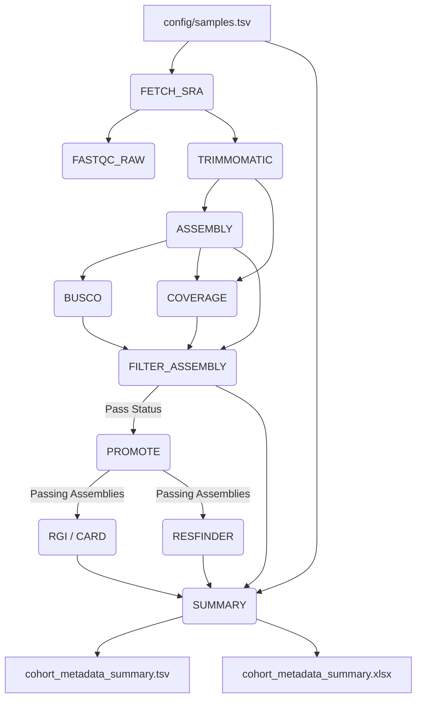

# blaCTX Pipeline

Nextflow workflow for reproducible *Klebsiella pneumoniae* whole-genome
analysis, with emphasis on assembly quality control and detection of
extended-spectrum beta-lactamase genes, including **blaCTX-M-15**.

## Overview

The pipeline automates raw read processing, assembly, quality filtering, and dual-tool AMR screening:
1. **Fetch & Preprocess:** Retrieves SRA/ENA reads and performs QC/trimming (FastQC, Trimmomatic).
2. **Assemble & QC:** Assembles genomes (Shovill/SKESA) and evaluates quality (BUSCO, read-depth coverage).
3. **Filter:** Filters assemblies based on completeness, coverage, and contig thresholds.
4. **AMR Screening:** Screens passing assemblies using **RGI/CARD** and **ResFinder**.
5. **Report:** Generates a unified cohort-level metadata summary (`TSV` / `XLSX`).



## Prerequisites

- **OS:** Linux / WSL2
- **Workflow Manager:** Nextflow (>= 22.10)
- **Environment Manager:** Conda / Mamba

## Directory structure

```
.
├── main.nf                    # Nextflow DSL2 entry point
├── nextflow.config            # Workflow parameters & execution settings 
├── config/
│   ├── config.yaml            # Project thresholds & DB paths
│   └── samples.tsv            # Sample manifest
├── workflow/
│   ├── envs/                  # Conda environment YAMLs
│   ├── scripts/               # Utility Python scripts
├── resources/                 # Local reference DBs
```

## Reference Databases

The pipeline requires specific reference databases placed under the `resources/` directory:

| Database / Resource | Dataset / Target | Version / Release Info | Local Path |
| :--- | :--- | :--- | :--- |
| **CARD** | Comprehensive Antibiotic Resistance Database | v4.0.2 | `resources/card_data/card.json` |
| **ResFinder DB** | Acquired Antimicrobial Resistance Genes | Commit [`eecf0aa`](https://bitbucket.org/genomicepidemiology/resfinder_db) (Jan 2026) | `resources/resfinder/db_resfinder` |
| **BUSCO Lineage** | Lineage Dataset for Genome Assessment | `enterobacterales_odb10` (OrthoDB v10.1) | `resources/busco_db` |

> **Note:** Ensure database paths in `main.nf` or `nextflow.config` match your local directory setup before executing runs.
Place the databases under:

```text
resources/
├── busco_db/
├── card/
└── resfinder
```

## Setup & Credentials 

Before running, export your NCBI credentials for metadata fetching: 

```bash
export NCBI_EMAIL="you@example.org"
export NCBI_API_KEY="replace-with-a-secret"
```

## Quick Start 

Execute the complete workflow 

```bash
nextflow run main.nf \
  --samples config/samples.tsv \
  --results results \
  --threads 8 \
  --target_gene blaCTX-M-15 \
  -with-conda \
  -resume
```

 Note: To inspect standalone Python script contracts, run python workflow/scripts/<script_name>.py --help. 

## Follow-Along Example & Expected Output

To test the pipeline with the provided example manifest (`config/samples.tsv`):

1. **Run the pipeline** using the Quick Start command above.
2. **Verify Results:** Upon completion, the pipeline generates the primary aggregated summary files under `results/06_metadata/`:
   - `results/06_metadata/cohort_metadata_summary.tsv`
   - `results/06_metadata/cohort_metadata_summary.xlsx`

You can compare your results with our expected output. We provide reference output files in `results/expected_output/` for pipeline output validation.
## Outputs

| Directory | Contents |
|---|---|
| `results/00_raw_reads/` | Raw FASTQ files |
| `results/01_qc/fastqc_raw/` | Raw-read FastQC reports |
| `results/01_qc/trimmed/` | Paired trimmed reads |
| `results/02_assembly/` | Per-sample assemblies and coverage files |
| `results/03_busco/` | BUSCO short summaries |
| `results/04_filtered_assemblies/` | Filter status JSON and promoted assemblies |
| `results/05_amr/rgi/` | RGI tabular and JSON outputs |
| `results/05_amr/resfinder/` | ResFinder outputs |
| `results/06_metadata/` | Cohort TSV and XLSX summary |


## Citation & License 

This project is licensed under the MIT License. See the [LICENSE](LICENSE) file for details.

Please cite Nextflow, Shovill, BUSCO, RGI/CARD, and ResFinder when publishing results.

